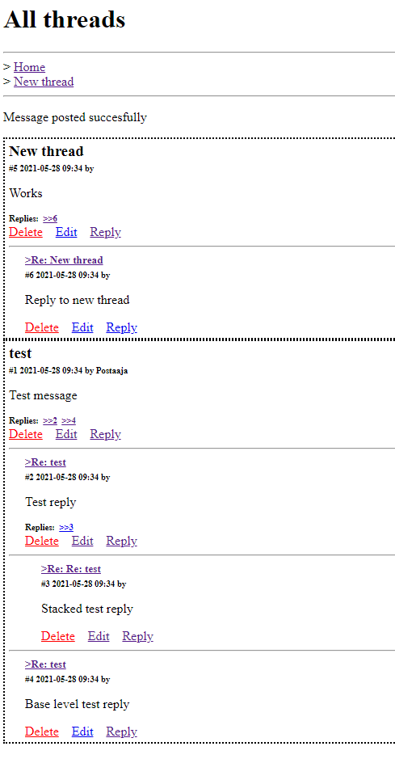

# Simple flask message board

Simple message board app made in flask.  

Documentation sources used for project:  
* https://jinja.palletsprojects.com/en/2.11.x/api/
* https://terokarvinen.com//2016/flask-templates/index.html
* https://flask-sqlalchemy.palletsprojects.com/en/2.x/
* https://developer.mozilla.org/en-US/docs/Web/CSS/:target

