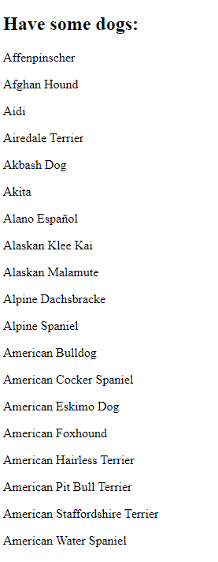

# Assignment PW2.3, Template rendering items in array using for loop.

This page renders template and assigns values set to variable 'content' by iterating throug it using  and assigning values with {{ item }}.

