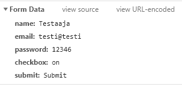

# Assignment PW2.4, Template form usng POST method

This page renders template that has a POST form. Clicking send transmits the values to server using http POST method. It also returns the values to client as Dictionary.

