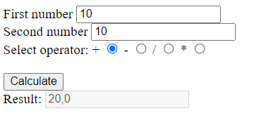

# Assignment PW2.5, Template with basic calculator

This page renders template with a simple calculator that asks for 2 numbers and an operator. Clicking calculate returns the calculated value, or empty result if one of the numbers is not filled.
Only numbers are permitted on the form.

