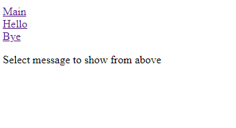

# Assignment PW3.1, Template rendering with two flask messages

This page renders template and binds 3 url's (/, /hello and /bye). By clicking on the /bye and /hello links different messages are rendered.

