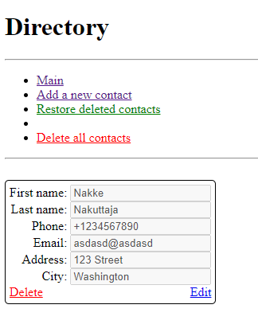

# Assignment PW4, simple contact directory

This app is a simple contact directory with ability to add, edit, delete and restore deleted contacts.  
The app works by using the links on the top menu, as well as using the links on the contact cards.  
Contact delete is done by setting the contact value "deleted" to current timestamp. Restore is done by deleting said timestamp.

